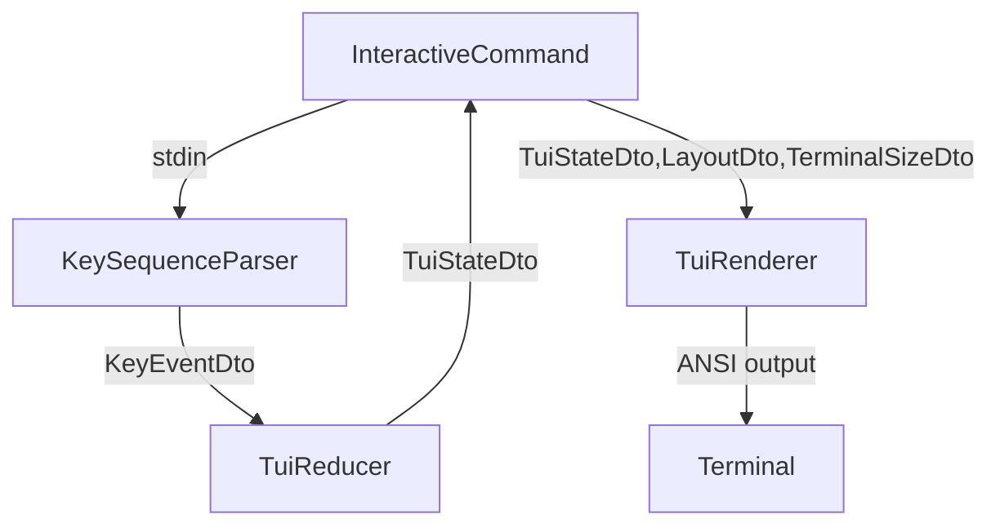

## TUI (InteractiveCommand)

Этот документ описывает внутреннюю архитектуру интерактивного TUI-интерфейса команды `interactive`.

### Назначение

Команда `interactive` (`src/classes/command/InteractiveCommand.php`) предоставляет простой текстовый UI:

- область вывода (история сообщений) с прокруткой;
- многострочное поле ввода (3 строки) с редактированием;
- строка состояния (mode/cursor/history count);
- переключение фокуса `Tab` (ввод/просмотр).

### Архитектура (компоненты)

- **Terminal режимы**: `src/classes/command/terminal/TerminalModeManager.php`
  - включает `stty -icanon -echo`, alt-buffer, скрывает курсор;
  - обязательно использовать через `try/finally`, чтобы терминал гарантированно восстановился.

- **Ввод**: `src/classes/command/input/`
  - `Utf8CharReader` — читает один UTF‑8 символ из потока;
  - `KeySequenceParser` — превращает поток в события `KeyEventDto`:
    - стрелки, PageUp/PageDown, Tab, Enter, Backspace, Ctrl+C, текст.

- **Состояние**: `src/classes/dto/tui/`
  - `TuiStateDto` — модель состояния (history/input/cursor/focus/scroll + поля для partial redraw);
  - `LayoutDto` — вычисленная геометрия (координаты областей и `getOutputVisibleLines()`);
  - `TerminalSizeDto` — размеры терминала (width/height);
  - `KeyEventDto` — нормализованное событие клавиатуры.

- **Обработка событий (reducer)**: `src/classes/command/state/TuiReducer.php`
  - единственное место, где описаны правила изменения `TuiStateDto` по `KeyEventDto`;
  - важно: логика остановки по `Ctrl+C` обрабатывается до вставки текста.

- **Отрисовка**: `src/classes/command/render/TuiRenderer.php`
  - full render (очистка и полная отрисовка рамок/контента/курсора);
  - partial render (обновление только изменившихся строк ввода и статус-бара);
  - для переносов/выравнивания использует `src/helpers/TuiTextHelper.php`.

### Поток данных

### Тесты

Тесты на «чистые» части вынесены в `tests/Tui/`:

- `KeySequenceParserTest` — распознавание событий (включая ESC-последовательности и UTF‑8);
- `TuiReducerTest` — граничные условия редактирования/скролла/фокуса;
- `LayoutDtoTest` — вычисление производных значений.

